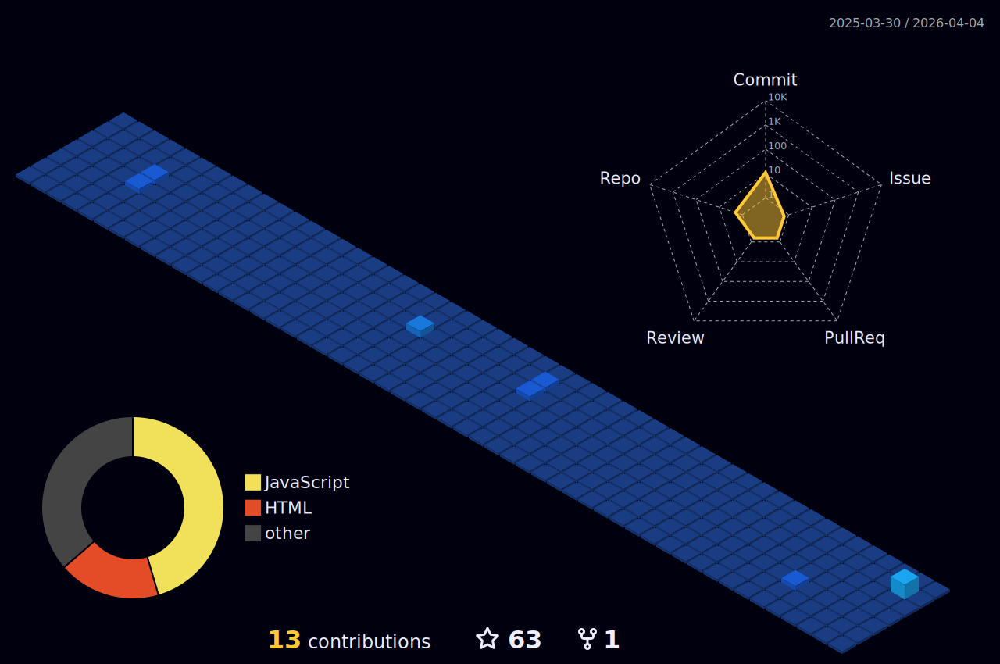

<!-- Include the additional GIF at the top -->

  

# Hello World, I'm Jas Sharma! 👨‍💻

## 🚀 About Me
I'm Jas Sharma, an aspiring technologist currently pursuing a B.Tech in Robotics and Automation at the University School of Automation and Robotics. My academic journey is a quest to blend the physical prowess of robotics with the cognitive prowess of artificial intelligence.

### 💼 My Interests
I'm deeply enthralled by the potential of robotics and machine learning to revolutionize the way we interact with the world around us. From autonomous vehicles to smart cities, my interest lies at the heart of innovation, where technology serves as a bridge to a sustainable future.

### 🛠️ Skills and Expertise
My toolkit is a tapestry of programming languages and frameworks designed to tackle the complexities of:
- **Machine Learning (ML)**: Crafting algorithms that predict and analyze with precision.
- **Deep Learning (DL)**: Architecting neural networks that mimic the intricacies of human cognition.
- **Data Analytics**: Interpreting vast datasets to unearth actionable insights using R and Python.

<!-- Include the GIF in the middle of the profile -->

## 📈 GitHub Metrics

## 🏆 GitHub Profile Trophy

## 📊 GitHub 3D Contribution Graph - Night View

  

## 📝 Medium Blogs
As a writer on Medium, I explore the depths of robotics and machine learning. Check out my stories and tutorials that demystify complex concepts and offer practical advice.

- [Understanding Robotics in the Age of AI](#)
- [Demystifying Deep Learning: A Practical Approach](#)
- [The Future of Data Analytics in Machine Learning](#)

## 🌐 Languages and Frameworks
I've immersed myself in a multitude of languages and frameworks that are at the forefront of technological advancement.

<!-- Include the additional GIFs in the frameworks section -->

  
  
  
  
  
  
  
  

## 🌟 Let's Connect!
I'm always excited to connect with fellow tech enthusiasts, researchers, and collaborators. Feel free to reach out to me on [LinkedIn](https://www.linkedin.com/in/jas-sharma-217614233) to start a conversation or collaborate on exciting projects.

