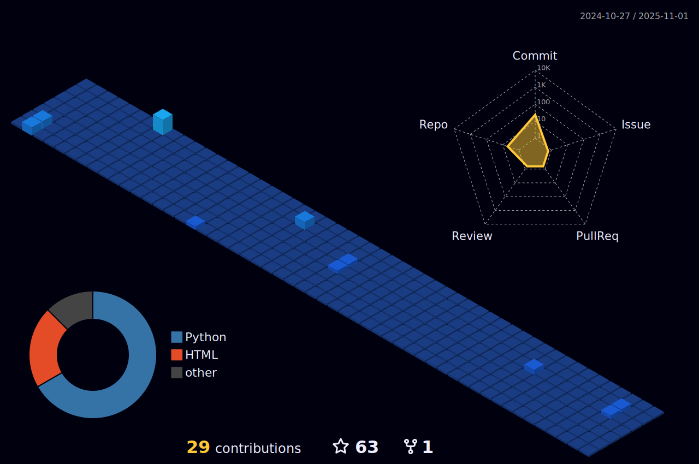

# Jas Sharma | Robotics & AI Research Engineer

  
  

---

### 🎯 Research Focus Areas
**Autonomous Systems** • **Machine Intelligence** • **Data-Driven Innovation**

## 🔬 Research Profile

**Academic Pursuit:** B.Tech in Robotics and Automation  
**Institution:** University School of Automation and Robotics  
**Research Interest:** Intersection of robotics, artificial intelligence, and sustainable technology solutions

### 🧠 Current Research Domains

  

---

## 📊 Research Metrics & Analytics

<table>
<tr>
<td width="50%">

**📈 Development Analytics**

</td>
<td width="50%">

**🔍 Technical Stack**

</td>
</tr>
</table>

  

### 📌 Project Impact Metrics

  
  
  

---

## 🏆 Research Achievements

  

---

## 📊 3D Research Contributions Visualization

  

---

## 📚 Technical Research Areas

### 🤖 **Machine Learning & Deep Learning**
Advanced algorithm development for predictive modeling, neural network architectures, and cognitive computing systems.

### 📊 **Data Analytics & Computational Science**  
Statistical analysis, data mining techniques, and computational methods using R and Python for extractive insights.

### 🔧 **Robotics Engineering**
Autonomous system design, sensor integration, and human-robot interaction protocols.

---

## 🛠️ Research Technology Stack

**Core Languages & Frameworks**

**Data Science & Analytics**

### 🔬 Technical Visualization Gallery

  
  
  
  

  
  
  
  

---

## 📝 Research Publications & Technical Writing

As a contributing researcher on Medium, I publish technical articles exploring advanced concepts in robotics, machine learning, and data science methodologies.

**Featured Research Areas:**
- Understanding Robotics in the Age of AI
- Demystifying Deep Learning: A Practical Approach  
- The Future of Data Analytics in Machine Learning

---

## 🌐 Research Collaboration

**Open to Research Collaborations**

Interested in collaborative research projects, academic partnerships, or technical discussions in robotics, AI, and automation systems.

---

### 🔬 "Technology is not just about solving problems—it's about reimagining possibilities."

**Research Focus:** *Bridging the gap between theoretical AI concepts and practical robotic applications*

